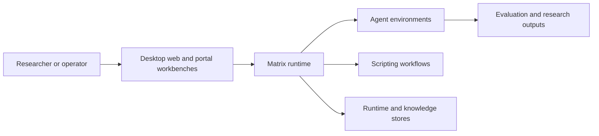

# Aletheia

[Back to Software Platforms](../)

Aletheia is an AI and cognitive framework for agent-based environments, multi-agent simulations, automation workflows, teaching libraries, and structured reasoning systems.

---

## Platform Status

- Status: Active and research-oriented
- Documentation level: Public architecture summary and research mapping
- Public boundary: no source code, credentials, private datasets, or deployment details

---

## Purpose

Aletheia explores how software systems can model reasoning, operate environments, coordinate agents, and preserve knowledge across repeatable workflows.

It is intended as a foundation for intelligent systems that need environment lifecycle management, scripting, evaluation, and human-facing workbenches instead of isolated prompts or disconnected automation.

---

## Motivation

Many AI systems focus on output generation without a strong structure for reasoning, context, validation, or knowledge reuse.

Aletheia exists to investigate how reasoning can be represented, evaluated, improved, and reused across domains.

---

## Business Problem

Organizations need systems that can support complex decisions with traceability, consistency, and a clear relationship between data, reasoning, and outcome.

Aletheia addresses the problem of turning fragmented knowledge and decision logic into a structured platform.

---

## Architecture Overview

At a public level, Aletheia can be described through these layers:

- Matrix runtime for coordinating root servers, child servers, and environment handles
- Environment lifecycle layer for creating, starting, pausing, resuming, stopping, and removing environments
- Agent and action APIs for turn-based and real-time workflows
- Administration layer for REST access, authentication, users, groups, and permissions
- Persistence layer for runtime state, authorization, scripting, workspaces, and search corpora
- Scripting layer for automation and experimentation
- Desktop, web, and portal workbenches for human interaction

This description is intentionally implementation-neutral and avoids private source details.

---

## Technologies

The platform is connected to these technology areas:

- Java 21 and Maven multi-module architecture
- REST administration services
- SQLite persistence
- authentication and authorization workflows
- JavaScript, Prolog, Python, Lisp, and Common Lisp scripting
- Swing desktop interfaces
- Vaadin web interfaces and portal workflows
- AI, game simulation, text search, and environment tooling

---

## Engineering Decisions

Key engineering decisions include:

- separating environment and reasoning models from application-specific workflows
- keeping knowledge structures explicit and reviewable
- designing for extension across environments, tools, scripts, and workbenches
- emphasizing traceability between inputs, reasoning, and outcomes
- supporting experimentation without binding the platform to a single domain

Tradeoffs considered:

- prioritizing structured reasoning and traceability over quick one-off AI outputs
- keeping public documentation implementation-neutral so the architecture can be discussed safely

---

## Usage Scenario

A researcher defines a controlled environment, connects agents or scripts to it, observes repeated runs, and uses the workbench to inspect behavior, state, and evaluation signals.

---

## Technical Challenge

The main challenge is keeping environments, agents, scripts, persistence, and human workbenches coordinated without turning the framework into a single-purpose AI application.

The architecture addresses this by separating environment lifecycle, runtime coordination, scripting, persistence, and presentation concerns.

---

## Engineering Lesson Learned

AI-oriented systems become easier to evaluate when reasoning, environment state, and execution history are explicit parts of the architecture instead of hidden side effects.

---

## Platform Relationships

- Can inform AI-assisted workflow design in EgypTeam POS.
- Can provide research patterns for evaluation and structured reasoning across future platform experiments.
- Can support synthetic experiments derived from CDM and EgypTeam Via scenarios.

---

## Screenshots

Sanitized production screenshots are available under [screenshots](screenshots/):

- [Public release page](screenshots/01-public-soon.png)
- [Portal access request form](screenshots/02-register-request-access.png)
- [Access request submitted](screenshots/03-register-submitted.png)
- [Portal sign-in](screenshots/04-portal-sign-in.png)
- [Approved user dashboard](screenshots/06-dashboard.png)
- [Marketplace](screenshots/07-marketplace.png)
- [Installed applications](screenshots/08-applications-installed.png)
- [Console handoff to Aletheia Web UI](screenshots/09-aletheia-web-ui-console-handoff.png)
- [Matrix workbench](screenshots/10-aletheia-matrix-workbench.png)
- [Text search workspace](screenshots/11-aletheia-text-search.png)
- [Tic-Tac-Toe remote game server setup](screenshots/12-tictactoe-game-server-dialog.png)
- [Tic-Tac-Toe remote game server created](screenshots/13-tictactoe-game-server-created.png)
- [Human Tic-Tac-Toe remote client](screenshots/14-tictactoe-human-client-opened.png)
- [Alpha-beta JavaScript scripted core agent selection](screenshots/15-tictactoe-scripted-agent-selection.png)
- [Alpha-beta scripted agent joined](screenshots/16-tictactoe-scripted-agent-joined.png)
- [Human move 1](screenshots/17-tictactoe-human-move-1.png)
- [Alpha-beta response 1](screenshots/18-tictactoe-alpha-beta-response-1.png)
- [Human move 2](screenshots/19-tictactoe-human-move-2.png)
- [Alpha-beta response 2](screenshots/20-tictactoe-alpha-beta-response-2.png)
- [Human move 3](screenshots/21-tictactoe-human-move-3.png)
- [Alpha-beta response 3](screenshots/22-tictactoe-alpha-beta-response-3.png)
- [Human move 4](screenshots/23-tictactoe-human-move-4.png)
- [Alpha-beta response 4](screenshots/24-tictactoe-alpha-beta-response-4.png)
- [Human final move and match result](screenshots/25-tictactoe-human-final-move.png)

The screenshots use a synthetic production demo account with an isolated Matrix root and contain no proprietary source code, customer data, credentials, or raw tokens.

---

## Future Roadmap

Near-term:

- [Engineering quality] Formalize the core cognitive model and document stable concepts.
- [Product evolution] Document example agent, environment, scripting, and reasoning workflows that can be reused across domains.

Medium-term:

- [Research] Define evaluation metrics for reasoning quality and consistency.
- [Engineering quality] Connect the platform to controlled synthetic datasets for repeatable evaluation.

Long-term:

- [Research] Prepare research notes and technical reports about traceable AI-assisted reasoning.

---

## Related Research

- Research index: [Research](../../research/)
- Public product site: [aletheia.egypteam.com](https://aletheia.egypteam.com/)
- Public EgypTeam research page: [egypteam.com/research/aletheia](https://egypteam.com/research/aletheia)
- Primary direction: structured reasoning, agent environments, evaluation workflows, and AI-assisted decision support
- Future artifacts: technical reports, controlled experiments, and synthetic reasoning datasets

---

## Research Opportunities

Possible future publications:

- A framework for structured cognitive modeling in software systems
- Traceable reasoning architectures for AI-assisted decision support
- Knowledge reuse patterns in applied AI platforms

Possible experiments:

- Compare structured reasoning workflows with unstructured prompt workflows
- Evaluate consistency across repeated decision scenarios
- Measure explainability and review effort for different knowledge structures

Possible technical reports:

- Aletheia architecture overview
- Reasoning traceability model
- Evaluation strategy for cognitive software platforms

Possible datasets:

- synthetic reasoning cases
- anonymized decision traces
- benchmark scenarios for knowledge reuse

