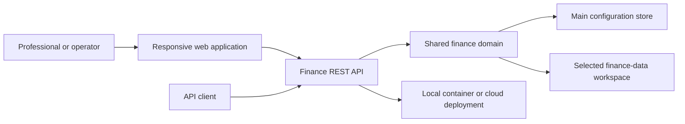

# Aurum

[Back to Software Platforms](../)

Aurum is a financial management platform for organizing accounts, ledger entries, revenues, vendors, and multiple finance-data workspaces.

---

## Platform Status

- Status: Active and evolving
- Documentation level: Public architecture and engineering summary
- Public boundary: no personal financial records, credentials, private infrastructure, or customer data

---

## Purpose

Aurum provides a structured workspace for financial information that would otherwise be distributed across spreadsheets, bank statements, notes, and separate tools.

The platform supports both operational finance workflows and the technical concerns required to preserve consistency, traceability, and controlled access to financial data.

---

## Motivation

Financial information becomes difficult to maintain when account structures, recurring revenue, vendors, planned entries, and historical statements are managed independently.

Aurum exists to make those relationships explicit while preserving a path from an initial local application to more flexible multi-storage and deployment strategies.

---

## Business Problem

People and small organizations need reliable visibility into accounts, income, vendors, planned transactions, and historical entries without losing the context that explains each number.

Aurum addresses this through a domain-oriented finance model, persistent local storage, workspace selection, and APIs that can support multiple user interfaces.

---

## Architecture Overview

At a public level, Aurum can be described through these layers:

- Shared domain library for accounts, entries, revenues, vendors, and storage concepts
- REST API for finance operations and data-storage administration
- Responsive web application for interactive finance workflows
- SQLite-backed configuration and operational data storage
- Optional in-memory mode for ephemeral development sessions
- Deployment strategies that can evolve from local execution to container and cloud environments

The architecture keeps the Web and API applications independently deployable while allowing them to work together as one local experience.

---

## Technologies

The platform is connected to these technology areas:

- Java and Gradle multi-module architecture
- Spring Boot REST API and web application
- Thymeleaf-based responsive interface
- SQLite persistence
- in-memory storage for ephemeral development
- encrypted data-source credential persistence
- Docker and Kubernetes-oriented deployment strategies
- Azure, AWS, GCP, and FTP deployment adapters

---

## Engineering Decisions

Key engineering decisions include:

- separating shared finance domain classes from API and Web modules
- treating accounts, entries, revenues, vendors, and data storages as explicit domain concepts
- keeping the API and Web applications independently deployable
- supporting persistent SQLite operation while retaining an in-memory mode for fast experiments
- encrypting data-source credentials before persistence
- allowing operational finance data to be selected through a workspace boundary while keeping administration in the main configuration space

Tradeoffs considered:

- prioritizing a simple local-first deployment model over immediate cloud-specific coupling
- supporting multiple deployment paths without making each deployment provider part of the core finance domain
- keeping public documentation high-level because the platform handles sensitive financial concepts

---

## Usage Scenario

A user defines accounts and vendors, records revenue and ledger entries, marks planned transactions, and reviews the resulting statements through a Web workspace. A client can select a finance-data workspace through the API when operational data must be separated from configuration data.

---

## Technical Challenge

The main challenge is maintaining financial data consistency while allowing multiple storage contexts and deployment modes.

Aurum addresses this by keeping the finance domain explicit, separating configuration from operational workspace data, and centralizing storage access behind API and service boundaries.

---

## Engineering Lesson Learned

Financial systems benefit from explicit domain boundaries and traceable state transitions. A flexible storage strategy is useful only when the application clearly distinguishes configuration, credentials, and operational records.

---

## Platform Relationships

- Can provide finance-domain and traceability patterns for EgypTeam POS.
- Can contribute data-quality and evidence concepts to future research work.
- Can reuse the portfolio's documentation and deployment workflow patterns across other Java platforms.

---

## Screenshots

No public screenshots are included yet.

Future images should be sanitized and added under [screenshots](screenshots/).

---

## Future Roadmap

Near-term:

- [Engineering quality] Document the public finance domain model and consistency rules.
- [Product evolution] Add sanitized examples for account, statement, revenue, vendor, and workspace workflows.

Medium-term:

- [Engineering quality] Expand automated tests around storage isolation, credential encryption, and planned entries.
- [Product evolution] Improve cross-workspace reporting and financial review workflows.

Long-term:

- [Research] Prepare technical reports about local-first financial systems and traceable personal finance data.

---

## Related Research

- Research index: [Research](../../research/)
- Primary direction: financial domain modeling, storage isolation, data quality, and traceable operational workflows
- Future artifacts: technical reports, synthetic financial datasets, and controlled consistency experiments

---

## Research Opportunities

Possible future publications:

- Local-first architecture patterns for personal financial systems
- Workspace isolation and traceability in operational finance platforms
- Domain modeling strategies for planned and realized financial entries

Possible experiments:

- Compare spreadsheet-based financial review with structured workspace review
- Evaluate consistency checks across account, revenue, vendor, and statement workflows
- Measure review effort for planned versus realized financial data

Possible technical reports:

- Aurum architecture overview
- Finance workspace and storage model
- Credential protection and multi-storage integration strategy

Possible datasets:

- synthetic account and ledger histories
- synthetic revenue and vendor catalogs
- anonymized planned-entry consistency scenarios
