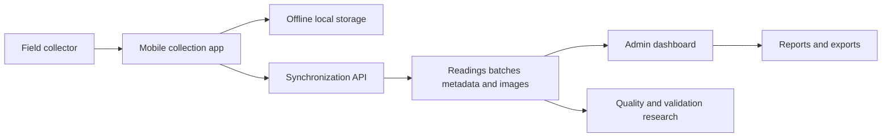

# CDM

[Back to Software Platforms](../)

CDM is a water measurement system for collecting, synchronizing, managing, and analyzing meter readings in residential and condominium environments.

---

## Platform Status

- Status: Active applied platform
- Documentation level: Public architecture summary and research mapping
- Public boundary: no customer data, private measurement records, credentials, or deployment details

---

## Purpose

CDM supports field collection of water readings, API-based synchronization, administrative review, reporting, and export workflows.

It is designed to improve the reliability of measurement collection while preserving evidence, batch history, and operational visibility.

---

## Motivation

Water measurement work depends on accurate field input, repeatable collection flows, local resilience, image evidence, and reliable synchronization.

Manual collection or disconnected spreadsheets make it harder to audit readings, verify evidence, generate reports, and track collection progress.

CDM exists to make field measurement workflows structured, traceable, and easier to validate.

---

## Business Problem

Residential and condominium operations need dependable meter readings for billing, analysis, dispute resolution, and historical tracking.

When readings, photos, devices, units, and reports are disconnected, teams lose confidence in the measurement process and spend more time reconciling data manually.

CDM addresses these problems through mobile collection, batch synchronization, administrative review, evidence handling, and exportable reports.

---

## Architecture Overview

At a public level, CDM can be described through these components:

- Mobile field collection application
- Offline-first local reading storage
- API layer for synchronization and measurement management
- Domain model for units, devices, batches, readings, metadata, and images
- Administrative dashboard for review, filtering, reporting, and export
- API documentation layer for integration and validation

The documentation avoids private customer data, credentials, deployment details, and proprietary business rules.

---

## Technologies

The platform is connected to these technology areas:

- Flutter mobile application development
- Laravel and PHP backend services
- React, Inertia.js, and TailwindCSS web interfaces
- MySQL relational storage
- Swagger and OpenAPI documentation
- image capture and file handling
- Excel, CSV, PDF, XML, and JSON exports
- automated API and feature testing

---

## Engineering Decisions

Key engineering decisions include:

- supporting offline-first field collection
- grouping readings into batches for controlled synchronization
- preserving image evidence alongside measurement records
- keeping measurement units, devices, readings, and batches explicit in the domain model
- providing multiple export formats for operational and reporting needs

Tradeoffs considered:

- prioritizing field reliability over always-online assumptions
- accepting additional storage and review complexity to preserve image evidence

---

## Usage Scenario

A field collector records meter readings offline, attaches image evidence, submits readings in controlled batches, and an administrator reviews the synchronized data through dashboards and exports.

---

## Technical Challenge

The main challenge is preserving measurement reliability across offline collection, image evidence, synchronization, administrative review, and export workflows.

The architecture addresses this by separating mobile collection, local persistence, API synchronization, measurement records, evidence handling, and dashboard review.

---

## Engineering Lesson Learned

Field data quality improves when the system preserves both the measured value and the evidence needed to review that value later.

---

## Platform Relationships

- Can generate research datasets and experiments for Aletheia-style validation and reasoning studies.
- Shares traceability and evidence-review concerns with EgypTeam POS document workflows.
- Can contribute field-data quality lessons to future operational platforms.

---

## Screenshots

No public screenshots are included yet.

Future images should be sanitized and added under [screenshots](screenshots/).

---

## Future Roadmap

Near-term:

- [Engineering quality] Add sanitized diagrams for mobile collection, synchronization, and dashboard review flows.
- [Product evolution] Document public-safe examples of measurement batches, image evidence, and export workflows.

Medium-term:

- [Product evolution] Expand role-based access and operational review workflows.
- [Research] Define measurement quality indicators for field collection, synchronization, and reporting accuracy.

Long-term:

- [Research] Evaluate OCR-assisted reading recognition and evidence-backed measurement validation.

---

## Related Research

- Research index: [Research](../../research/)
- Public product site: [cdm.egypteam.com](https://cdm.egypteam.com/)
- Public EgypTeam research page: [egypteam.com/research/cdm](https://egypteam.com/research/cdm)
- Primary direction: field measurement quality, offline synchronization, evidence-backed validation, and OCR-assisted review
- Future artifacts: technical reports, synthetic measurement datasets, and controlled validation experiments

---

## Research Opportunities

Possible future publications:

- Offline-first field collection architectures for residential utility measurements
- Evidence-backed data quality models for meter reading systems
- Human-in-the-loop OCR validation for operational measurement workflows

Possible experiments:

- Compare manual entry and OCR-assisted reading recognition
- Measure synchronization reliability under intermittent connectivity
- Evaluate the effect of image evidence on reading review and dispute resolution

Possible technical reports:

- CDM architecture overview
- Water measurement batch synchronization model
- Evidence-backed reporting and export strategy

Possible datasets:

- synthetic water meter reading scenarios
- anonymized measurement validation categories
- public OCR benchmark samples for meter-style digits

