# Echora

[Back to Software Platforms](../)

Echora is an evolving digital audio workstation (DAW) and device workstation for creating, performing, routing, and controlling music across desktop and web surfaces.

---

## Platform Status

- Status: Active and evolving
- Documentation level: Public architecture summary, product direction, and visual concepts
- Public boundary: no source code, credentials, private audio assets, or deployment details

---

## Purpose

Echora brings project work, MIDI devices, instruments, audio playback, routing, mixing, and live control into one musician-first workspace. Its daemon-centered foundation allows desktop, shell, CLI, GUI, and web clients to operate through a shared control surface.

---

## Motivation

Music-production tools often split composition, hardware control, routing, and remote operation into separate experiences. Echora explores a coherent workstation in which tracks, clips, devices, routes, transport, and meters remain immediately accessible.

---

## Architecture Overview

At a public level, Echora is organized around:

- a daemon runtime that owns project state, commands, capability decisions, and live engine status
- shared persistence for profiles, assets, instruments, routes, session state, and project snapshots
- MIDI discovery and normalized device events
- SoundFont playback and a sample-playback foundation
- typed control surfaces for CLI, shell, desktop GUI, and browser clients
- data-driven device definitions that describe parameters and reusable device-panel layouts

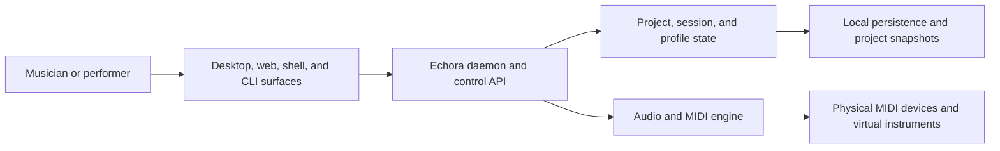

---

## Current Direction

The canonical DAW workspace keeps the essential production areas visible together:

- global menu and transport, including tempo, time signature, position, meters, and engine state
- library and device browser
- main editor for arrangement, piano roll, routing graph, or device panel
- mixer with channel strips, inserts, sends, mute, solo, record arm, faders, and live meters
- inspector for the selected track, clip, route, or device

Desktop is the primary studio surface. The web surface is designed as a peer workspace rather than a reduced administration dashboard: both share the same project, device, routing, mixer, and theme model, adapting only for platform constraints.

---

## Technologies

- Java 17 and Maven multi-module architecture
- daemon-centered TCP control API
- SQLite, Flyway migrations, and JPA repositories
- Java MIDI discovery and event normalization
- Java Sound with SoundFont playback and WAV-oriented sample support
- desktop GUI and browser-oriented UI entry points
- JSON project export, load, and last-session restore

---

## Engineering Decisions

- Keep music, routing, device, and mixer state in the project/runtime domain; persist workspace layout as a client preference.
- Use a shared typed contract for desktop and web rather than reconstructing state from presentation-oriented command output.
- Render device panels from reusable device definitions, so the same parameter model can serve different surfaces.
- Treat transport, meters, MIDI activity, and device state as live information, requiring a dedicated update channel as the product matures.
- Support `system`, `dark`, and `light` themes through semantic design tokens, keeping musical state colors meaningful in every theme.

---

## Usage Scenario

A musician opens or restores a project, selects a MIDI device and mapping profile, arranges clips or edits MIDI, inspects routes, adjusts a device panel, and mixes channels while transport and meters remain visible. The same project and domain operations can be accessed from a desktop studio setup or an adapted browser workspace.

---

## Screenshots

The following are the latest sanitized visual concepts for the planned Echora experience. They illustrate product direction and workspace coverage; they are not presented as completed production screens.

| Arrangement and live performance | Devices and routing |
| --- | --- |
| <a href="screenshots/echora-dark-arrangement-mixer.png">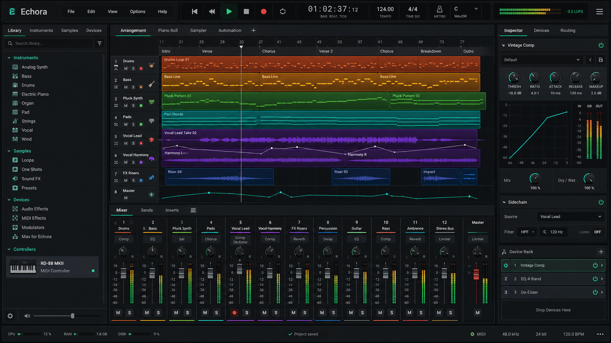</a> Dark arrangement and mixer workspace | <a href="screenshots/echora-dark-device-rack.png">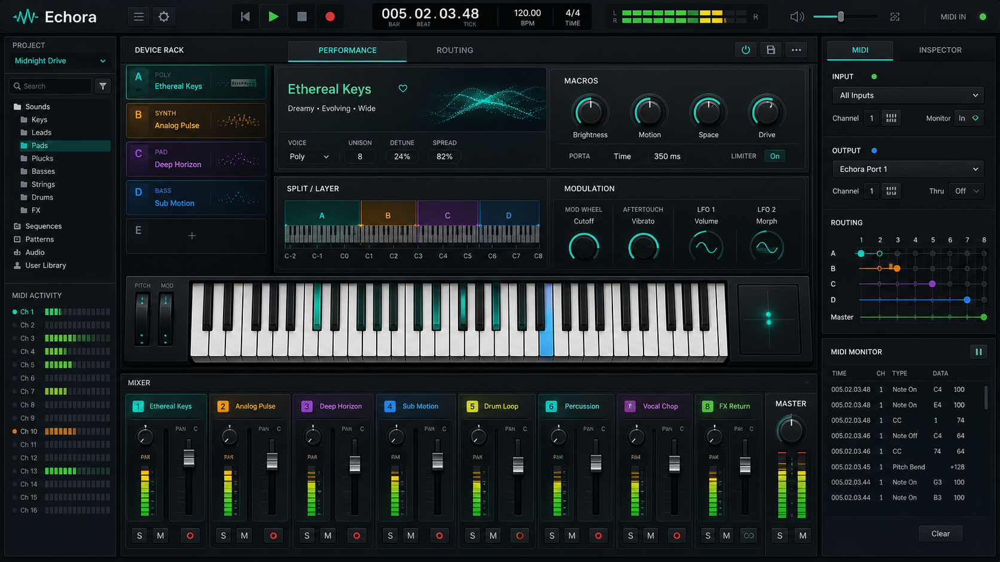</a> Device rack and performance workspace |
| <a href="screenshots/echora-dark-clip-launcher.png">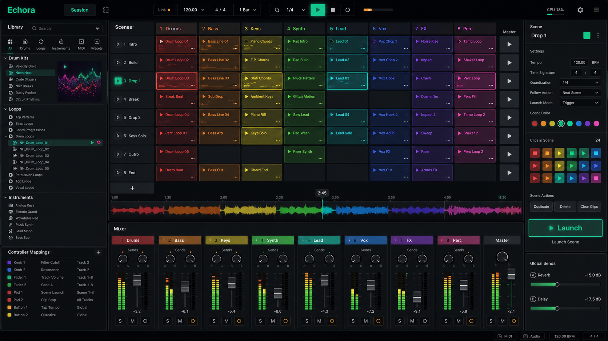</a> Clip launcher and live performance workspace | <a href="screenshots/echora-dark-routing-graph.png">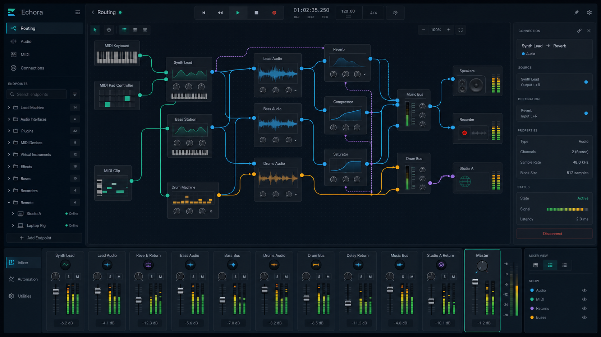</a> Audio, MIDI, and control routing graph |
| <a href="screenshots/echora-dark-automation-audio-edit.png">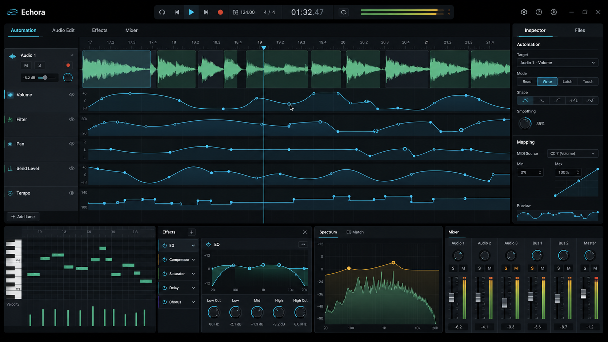</a> Automation and audio editing workspace | <a href="screenshots/echora-device-library.png">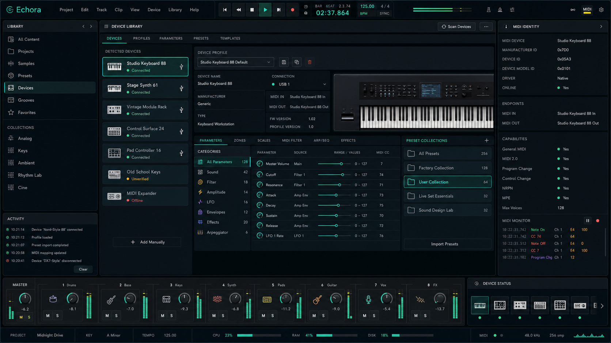</a> Device library and profile editor |
| <a href="screenshots/echora-light-piano-roll-mixer.png">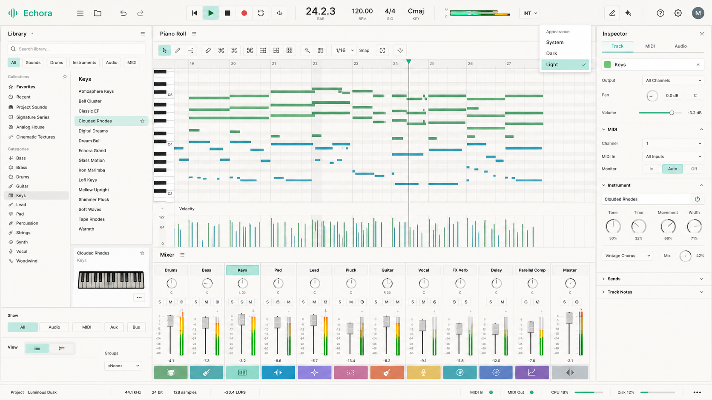</a> Light piano-roll and mixer workspace | <a href="screenshots/echora-midi-mapping-learn.png">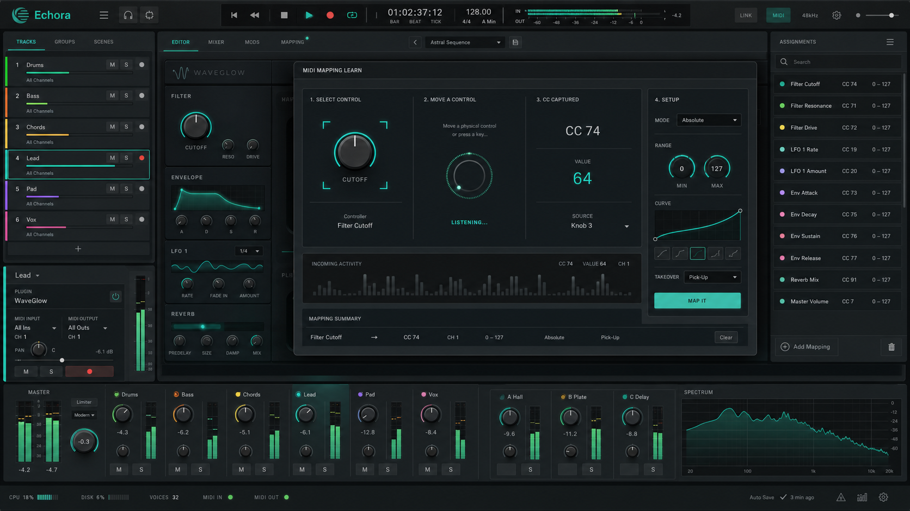</a> MIDI mapping learn |
| <a href="screenshots/echora-web-peer-workspace.png">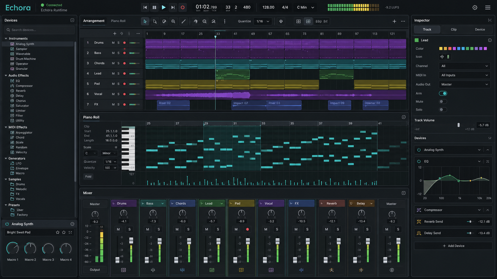</a> Web peer DAW workspace | <a href="screenshots/echora-audio-engine-hosts.png">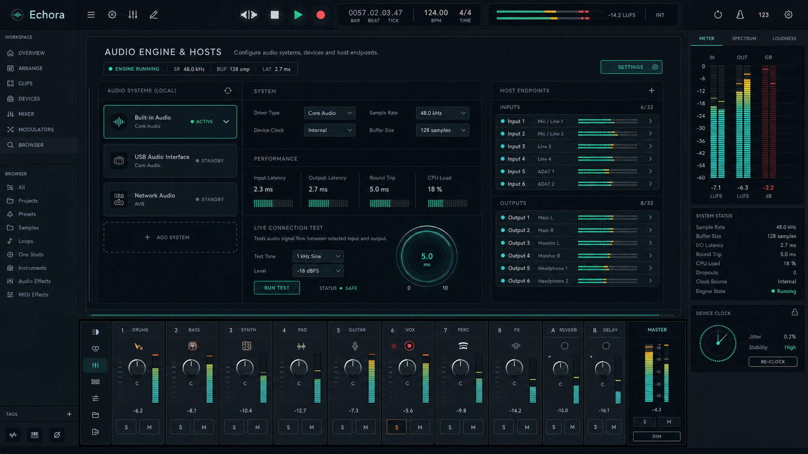</a> Audio engine and host endpoints |

The complete inventory, including recording, sampler, notation, mastering, remote-performance, instrument-builder, and project-template concepts, is available in [screenshots](screenshots/).

---

## Future Roadmap

Near-term:

- Define structured workspace, project, track, mixer, device, and routing view models in the daemon contract.
- Deliver the canonical desktop shell with transport, dockable workspace, mixer, browser, inspector, and theme selection.
- Implement the first complete device-panel workflow for the Roland XPS-30.

Medium-term:

- Add persisted workspace layout and theme preference.
- Provide a live-update stream for transport, meters, MIDI activity, and device state.
- Incrementally introduce arrangement, piano roll, recording, automation, and rendering without surface-only behavior.

Long-term:

- Extend cross-surface collaboration and remote-performance workflows.
- Develop reusable device and routing research artifacts grounded in public-safe demonstrations.

---

## Related Research

- Research index: [Research](../../research/)
- Primary direction: audio-device interaction, live performance systems, routing, and cross-surface workstation design
- Future artifacts: technical reports, synthetic device scenarios, usability studies, and controlled performance workflows

## Research Opportunities

Possible future publications:

- Cross-surface parity for digital audio workstations
- Data-driven device panels for hardware and virtual-instrument control
- Live audio and MIDI state synchronization in musician-first workspaces

Possible experiments:

- Compare desktop and browser completion of equivalent production tasks.
- Evaluate how workspace density and theme affect live-performance operation.
- Measure device-mapping reliability across physical and virtual MIDI sources.
