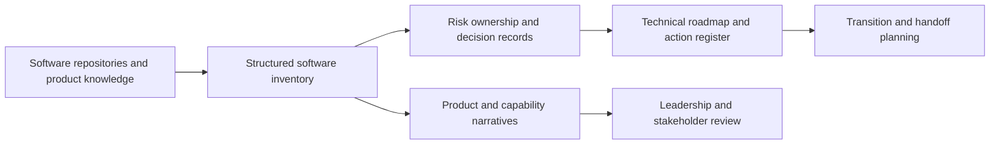

# EgypTeam ADM

[Back to Software Platforms](../)

EgypTeam ADM is a software portfolio, technology inventory, and technical governance workspace for mapping products, ownership, capabilities, risks, roadmaps, and transition plans.

---

## Platform Status

- Status: Active planning and governance workspace
- Documentation level: Public architecture and engineering summary
- Public boundary: no private conversations, customer data, credentials, commercial secrets, or internal ownership claims

---

## Purpose

ADM creates a structured view of the software ecosystem so technical leaders can understand what exists, who owns it, how it creates value, what risks are present, and what should happen next.

It combines software inventory with technical planning and transition documentation, turning scattered operational knowledge into reviewable engineering artifacts.

---

## Motivation

Growing software organizations often have multiple products, repositories, vendors, integrations, and operational responsibilities without one reliable map of the ecosystem.

ADM exists to support technology leadership through explicit inventory, product narratives, capability mapping, risk registers, action registers, roadmap sections, and structured handoff questions.

---

## Business Problem

Technology decisions become slower and riskier when product ownership, system purpose, technical dependencies, vendor relationships, operational gaps, and future plans are not documented together.

ADM addresses this by connecting software inventory with product positioning, technical profiles, governance notes, transition planning, and prioritized action tracking.

---

## Architecture Overview

At a public level, ADM can be described through these layers:

- Structured software inventory for products, repositories, ownership, and technical profiles
- Product narrative layer for purpose, audiences, use cases, and capabilities
- Governance layer for risks, gaps, decisions, action registers, and ownership mapping
- Transition-planning layer for context, near-term plans, handoffs, and communication
- Documentation workspace organized for review by technical and business stakeholders

The workspace is intentionally documentation-first: its main output is shared understanding and decision readiness rather than a deployed runtime.

---

## Technologies

The platform is connected to these technology areas:

- structured JSON inventory documents
- Markdown documentation and sectioned planning artifacts
- repository and product metadata
- technical roadmap and risk-register practices
- ownership and handoff mapping
- software portfolio and capability analysis
- review-oriented documentation workflows

---

## Engineering Decisions

Key engineering decisions include:

- treating software inventory as structured data instead of a static list
- keeping product identity, technical profile, deployment profile, and market narrative distinguishable
- separating confirmed facts, gaps, unknowns, and decisions
- organizing transition planning into focused, reviewable sections
- preserving action registers and decision logs as durable records
- documenting technology from both engineering and stakeholder perspectives

Tradeoffs considered:

- prioritizing clarity and decision support over immediate automation
- allowing qualitative leadership context while keeping technical facts structured
- documenting unknowns explicitly instead of presenting incomplete inventory as certainty

---

## Usage Scenario

A technical leader reviews the software inventory, identifies a product's role and dependencies, records ownership and risk gaps, creates a near-term technical roadmap, and uses the action register to guide a transition or planning conversation.

---

## Technical Challenge

The main challenge is preserving useful technical detail while making the software ecosystem understandable to people who need to make ownership, investment, roadmap, and risk decisions.

ADM addresses this by combining structured data with narrative documentation and by separating inventory facts from analysis, decisions, and future actions.

---

## Engineering Lesson Learned

Technical leadership becomes more effective when repository knowledge, product context, risks, and actions are connected in one navigable system. An inventory is valuable not only as a catalog, but as a starting point for decisions and ownership.

---

## Platform Relationships

- Provides portfolio and governance context for Aletheia, Atlas, Aurum, Galaxy, and other platforms.
- Can organize the technical narratives generated by the platform documentation program.
- Can contribute research material about software inventories, ownership transitions, and evidence-backed technology strategy.

---

## Screenshots

No public screenshots are included yet.

Future images should be sanitized and added under [screenshots](screenshots/).

---

## Future Roadmap

Near-term:

- [Governance] Continue normalizing product, repository, ownership, and capability records.
- [Engineering quality] Track gaps and unknowns separately from confirmed portfolio facts.

Medium-term:

- [Product evolution] Add cross-platform dependency and capability views.
- [Leadership] Connect risks, action registers, and roadmap decisions to measurable outcomes.

Long-term:

- [Research] Prepare technical reports about software portfolio governance and technology ownership transitions.

---

## Related Research

- Research index: [Research](../../research/)
- Primary direction: software portfolio management, technical governance, ownership mapping, and transition planning
- Future artifacts: technical reports, synthetic software inventories, and controlled roadmap decision studies

---

## Research Opportunities

Possible future publications:

- Structured software inventories for technical leadership
- Connecting repository facts to product and ownership decisions
- Documentation patterns for technology transitions and handoffs

Possible experiments:

- Compare repository-only discovery with structured portfolio inventory
- Evaluate whether explicit action registers improve transition follow-through
- Measure decision latency before and after product and risk context is consolidated

Possible technical reports:

- ADM architecture and information model
- Software inventory and ownership mapping strategy
- Technical transition planning framework

Possible datasets:

- synthetic software portfolio inventories
- anonymized risk and ownership registers
- technology transition planning scenarios
