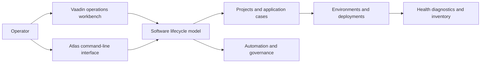

# EgypTeam Atlas

[Back to Software Platforms](../)

EgypTeam Atlas is a software lifecycle, deployment, and operations management platform for mapping software assets, environments, deployments, diagnostics, automation, and governance through one workbench.

---

## Platform Status

- Status: Active and evolving
- Documentation level: Public architecture and engineering summary
- Public boundary: no credentials, production identifiers, private case data, or internal endpoints

---

## Purpose

Atlas provides a structured operational view of software systems across their lifecycle. It connects application and project state with environment operations, deployment information, health diagnostics, inventory, and governance workflows.

The platform is intended to make operational context reviewable instead of distributing it across scripts, dashboards, terminals, and undocumented procedures.

---

## Motivation

Software operations become difficult to coordinate when application assets, environments, deployment state, diagnostics, and automation are represented in separate tools.

Atlas exists to provide a shared workbench and command-line interface for navigating that context while keeping project-specific data separated from the platform's generic lifecycle model.

---

## Business Problem

Teams need to understand what applications exist, where they run, how they are deployed, what their current health is, and which operational actions are safe to perform.

Atlas addresses this by combining software asset mapping, environment state, deployment workflows, diagnostics, inventory, automation, and governance in a single operational model.

---

## Architecture Overview

At a public level, Atlas can be described through these layers:

- Vaadin workbench for human-facing lifecycle and operations workflows
- Generic project and application state model
- Environment and deployment management layer
- Diagnostics and inventory snapshot layer
- Application-specific command modules, with Quantum as an initial case
- Java command-line interface for repeatable operations
- Governance and automation boundaries around project actions and credentials

Project-specific cases extend the generic lifecycle model without requiring the whole platform to become coupled to one application or provider.

---

## Technologies

The platform is connected to these technology areas:

- Java and Maven application architecture
- Vaadin workbench and browser-based operations UI
- command-line automation for repeatable workflows
- environment health and inventory diagnostics
- Azure CLI authentication flows
- browser-based provider authentication workflows
- structured JSON project, diagnostic, and inventory snapshots
- local development and cross-platform command wrappers

---

## Engineering Decisions

Key engineering decisions include:

- separating generic lifecycle concepts from application-specific operations
- keeping project state explicit so commands can be resumed and reviewed
- exposing both a workbench and CLI for human-guided and repeatable operations
- persisting diagnostics and inventory as inspectable snapshots
- supporting browser and device-code authentication without embedding credentials in documentation
- using placeholder authentication only for development dry runs

Tradeoffs considered:

- prioritizing operational traceability over a collection of disconnected provider scripts
- keeping provider integrations behind application-specific modules instead of polluting the core model
- preserving local-first workflows while leaving room for broader deployment and governance automation

---

## Usage Scenario

An operator selects a project and application case, connects to a target environment, completes an inventory operation, reviews health diagnostics, and preserves the resulting snapshots for later investigation or governance review.

---

## Technical Challenge

The main challenge is coordinating heterogeneous application providers and environments while keeping operational actions explicit, repeatable, and reviewable.

Atlas addresses this through a generic lifecycle model, application-specific command modules, persisted snapshots, and separate authentication boundaries.

---

## Engineering Lesson Learned

Operations platforms become more useful when diagnostics, inventory, deployment context, and automation state are treated as durable engineering artifacts rather than temporary command output.

---

## Platform Relationships

- Can provide deployment, diagnostics, and governance patterns for other portfolio platforms.
- Can support Galaxy's development-machine and runner operations with a higher-level lifecycle model.
- Can generate research around software asset inventories, operational evidence, and automation safety.

---

## Screenshots

No public screenshots are included yet.

Future images should be sanitized and added under [screenshots](screenshots/).

---

## Future Roadmap

Near-term:

- [Engineering quality] Document the public lifecycle model for projects, applications, environments, deployments, and diagnostics.
- [Product evolution] Add sanitized examples of workbench and CLI workflows.

Medium-term:

- [Engineering quality] Expand validation around inventory snapshots, diagnostic history, and provider boundaries.
- [Operations] Improve recovery and governance workflows for environment changes.

Long-term:

- [Research] Prepare technical reports about evidence-backed software operations and lifecycle governance.

---

## Related Research

- Research index: [Research](../../research/)
- Primary direction: software lifecycle management, operational evidence, diagnostics, automation, and governance
- Future artifacts: technical reports, synthetic application inventories, and controlled deployment-recovery experiments

---

## Research Opportunities

Possible future publications:

- Evidence-backed models for software lifecycle and deployment operations
- Application-specific extensions over generic operations platforms
- Governance patterns for safe automation across heterogeneous environments

Possible experiments:

- Compare script-only operations with project-aware lifecycle workflows
- Evaluate the usefulness of persisted diagnostic and inventory snapshots during recovery
- Measure operator effort for repeatable CLI workflows versus ad hoc procedures

Possible technical reports:

- Atlas architecture overview
- Project and application lifecycle model
- Diagnostics, inventory, and governance strategy

Possible datasets:

- synthetic application and environment inventories
- anonymized deployment and health-diagnostic timelines
- controlled recovery and governance scenarios
