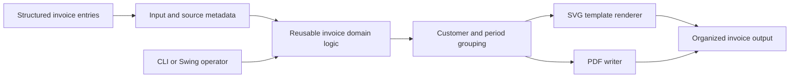

# EgypTeam Invoicing

[Back to Software Platforms](../)

EgypTeam Invoicing is a Java invoice-generation platform that combines reusable invoice business logic with CLI and Swing application modes, structured input processing, and SVG/PDF document output.

---

## Platform Status

- Status: Active and focused
- Documentation level: Public architecture and engineering summary
- Public boundary: no private financial records, customer information, credentials, or generated private documents

---

## Purpose

The platform converts structured invoice entries into reviewable invoice documents through repeatable command-line and desktop workflows.

It provides a small, explicit foundation for invoice calculation, grouping, rendering, and output organization without requiring a large service platform.

---

## Motivation

Invoice generation often begins as manual document editing or one-off scripts. Those approaches make calculation rules, input provenance, and output consistency difficult to test and reuse.

EgypTeam Invoicing exists to turn invoice generation into a deterministic application workflow with reusable domain logic and multiple user-facing entry points.

---

## Business Problem

Professionals and small operations need invoices that are generated consistently from structured entries, grouped correctly, and available in formats suitable for review, delivery, or downstream processing.

The platform addresses this through reusable calculation logic, JSON input handling, grouping by customer and period, and SVG/PDF output generation.

---

## Architecture Overview

At a public level, EgypTeam Invoicing can be described through these layers:

- Reusable library for invoice domain and calculation logic
- Application layer for CLI, demo, JSON, GUI, and automatic launch modes
- Structured input model for invoice entries and source metadata
- Grouping and defaults layer for customer and period-based processing
- SVG template rendering and PDF writing services
- Output organization layer for generated invoice artifacts

The reusable library keeps core invoice behavior independent from the CLI and Swing application surfaces.

---

## Technologies

The platform is connected to these technology areas:

- Java and Maven multi-module architecture
- command-line application workflows
- Swing desktop interface
- JSON input and structured source metadata
- SVG template rendering
- PDF document generation
- unit testing for application options and output services
- Make-based developer commands

---

## Engineering Decisions

Key engineering decisions include:

- separating reusable business logic from executable application modes
- supporting CLI and Swing without duplicating invoice calculations
- keeping source metadata and structured input explicit
- grouping entries by customer and period before document generation
- producing SVG and PDF from the same invoice model
- providing demo and headless-friendly modes for repeatable validation

Tradeoffs considered:

- prioritizing a focused document-generation tool over a full invoicing SaaS platform
- preserving simple local execution while leaving service integration for future work
- keeping output files inspectable and organized rather than hiding generation behind a remote API

---

## Usage Scenario

An operator provides structured invoice entries, selects JSON or demo mode, and receives organized SVG and PDF invoice artifacts grouped by customer and billing period. A desktop operator can use the Swing mode when an interactive environment is available.

---

## Technical Challenge

The main challenge is maintaining consistent calculation and rendering behavior across CLI, GUI, demo, and structured-input workflows.

The architecture addresses this by centralizing invoice logic in the reusable library and keeping input, grouping, rendering, and output as explicit stages.

---

## Engineering Lesson Learned

Document automation becomes easier to trust when the calculation model is independent from presentation and launch mode. Structured inputs and deterministic output paths also make generated artifacts easier to test and review.

---

## Platform Relationships

- Can support EgypTeam POS document and invoice workflows with reusable generation patterns.
- Can reuse Aurum's financial traceability concerns around source entries and output artifacts.
- Can contribute research material about deterministic document generation and human review.

---

## Screenshots

No public screenshots are included yet.

Future images should be sanitized and added under [screenshots](screenshots/).

---

## Future Roadmap

Near-term:

- [Engineering quality] Document the public invoice domain model and calculation boundaries.
- [Product evolution] Add sanitized example outputs and review workflows.

Medium-term:

- [Engineering quality] Expand tests around grouping, defaults, source metadata, and PDF/SVG parity.
- [Product evolution] Improve template customization and document validation.

Long-term:

- [Research] Prepare technical reports about deterministic document generation and reviewable financial artifacts.

---

## Related Research

- Research index: [Research](../../research/)
- Primary direction: invoice domain modeling, deterministic document generation, input provenance, and artifact review
- Future artifacts: technical reports, synthetic invoice datasets, and document-generation experiments

---

## Research Opportunities

Possible future publications:

- Architecture patterns for deterministic invoice generation
- Separating financial calculation logic from document presentation
- Provenance and reviewability in generated business documents

Possible experiments:

- Compare manual invoice preparation with structured generation workflows
- Evaluate SVG/PDF consistency across invoice templates
- Measure review effort for generated invoices with explicit source metadata

Possible technical reports:

- EgypTeam Invoicing architecture overview
- Invoice entry grouping and calculation model
- SVG and PDF output strategy

Possible datasets:

- synthetic invoice entries
- anonymized customer and billing-period groupings
- document rendering and validation scenarios
