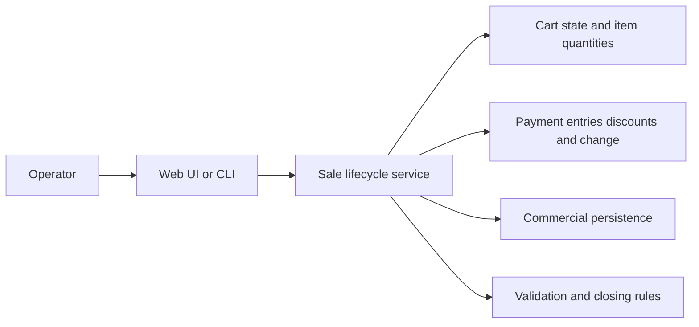

# EgypTeam Via

[Back to Software Platforms](../)

EgypTeam Via is a corporate commercial platform centered on Via Appia, with current public-safe documentation focused on dynamic sales-cart behavior and commercial transaction workflows.

---

## Platform Status

- Status: Active commercial platform
- Documentation level: Public domain and architecture summary
- Public boundary: no private business rules, customer data, deployment endpoints, or internal operational details

---

## Purpose

EgypTeam Via supports commercial operations where catalog selection, active sale state, item quantities, payment entries, discounts, change, and sale closing rules must remain consistent.

The public documentation keeps the focus on platform purpose and architecture, not private business rules or customer-specific deployment details.

---

## Motivation

Commercial workflows often require careful handling of mutable sales state before a transaction is finalized.

A cart can change repeatedly as items are added, quantities are adjusted, payments are split, discounts are applied, and totals are recalculated.

EgypTeam Via exists to make that operational flow explicit, testable, and available through more than one interaction model.

---

## Business Problem

Businesses need reliable handling of commercial transactions before final closure.

If cart state, payment state, discounts, remaining value, and change are not coordinated consistently, operators can face reconciliation errors and unclear transaction outcomes.

EgypTeam Via addresses this by structuring the sale lifecycle around current operator sessions, catalog operations, payment composition, recalculation, and controlled closing behavior.

---

## Architecture Overview

At a public level, EgypTeam Via can be described through these components:

- Commercial domain layer for catalog items, sale state, item quantities, payments, discounts, and change
- Web application interface for day-to-day commercial interaction
- Command-line interface for scripted or operational access
- API and service layer for sale lifecycle operations
- Persistence layer for application state and commercial records
- Health and deployment readiness layer for operational validation

Specific business rules, deployment endpoints, and internal implementation details are intentionally excluded.

---

## Technologies

The platform is connected to these technology areas:

- Java 21 backend development
- Spring Boot web applications
- Spring Data JPA persistence
- Thymeleaf server-rendered interfaces
- relational database development
- command-line operational tooling
- container and Kubernetes-oriented deployment workflows
- automated application testing

---

## Engineering Decisions

Key engineering decisions include:

- modeling one active sale per operator session
- merging repeated catalog selections through quantity changes
- recalculating totals after every item or payment mutation
- supporting multiple payment entries and controlled closing outcomes
- exposing the same commercial behavior through web and CLI interfaces

Tradeoffs considered:

- prioritizing explicit sale lifecycle rules over hidden cart mutation behavior
- keeping public documentation focused on domain patterns instead of private operational details

---

## Usage Scenario

An operator starts a current sale, adds catalog items, adjusts quantities, records multiple payment entries, and closes the sale only after totals, discounts, remaining value, and change are reconciled.

---

## Technical Challenge

The main challenge is maintaining a consistent mutable sale state while operators repeatedly change items, quantities, payment entries, discounts, and closing outcomes.

The architecture addresses this by centralizing sale lifecycle behavior and recalculating transaction state after every relevant mutation.

---

## Engineering Lesson Learned

Commercial workflows should make state transitions explicit because hidden cart mutation rules are difficult to test, explain, and audit.

---

## Platform Relationships

- Can use Emulare to validate commercial-device workflows where external peripherals are involved.
- Can generate transaction-state scenarios for future research experiments.
- Can provide commercial workflow examples for Aletheia-style reasoning and evaluation studies.

---

## Screenshots

No public screenshots are included yet.

Future images should be sanitized and added under [screenshots](screenshots/).

---

## Future Roadmap

Near-term:

- [Engineering quality] Add sanitized diagrams for sale lifecycle, cart mutation, payment composition, and closing outcomes.
- [Product evolution] Expand public documentation for catalog, sale state, and operator-session workflows.

Medium-term:

- [Engineering quality] Improve automated scenario coverage for cart operations, payment entries, discounts, and change.
- [Research] Define correctness indicators for mutable commercial transaction state.

Long-term:

- [Research] Prepare technical reports about sale lifecycle modeling and commercial workflow validation.

---

## Related Research

- Research index: [Research](../../research/)
- Primary direction: commercial transaction state, sale lifecycle validation, payment composition, and workflow correctness
- Future artifacts: technical reports, scripted lifecycle experiments, and synthetic commercial transaction datasets

---

## Research Opportunities

Possible future publications:

- State-machine modeling for mutable commercial transaction workflows
- Correctness patterns for sale lifecycle and payment composition systems
- Testing strategies for catalog-driven commercial applications

Possible experiments:

- Evaluate transaction-state consistency across repeated cart mutations
- Compare web-driven and command-line-driven commercial workflows
- Measure defect detection across scripted sale lifecycle scenarios

Possible technical reports:

- EgypTeam Via architecture overview
- Dynamic sales-cart lifecycle model
- Payment composition and closing-rule validation strategy

Possible datasets:

- synthetic sale lifecycle scenarios
- public catalog and payment-composition examples
- anonymized transaction-state validation categories

