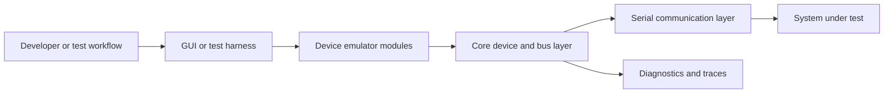
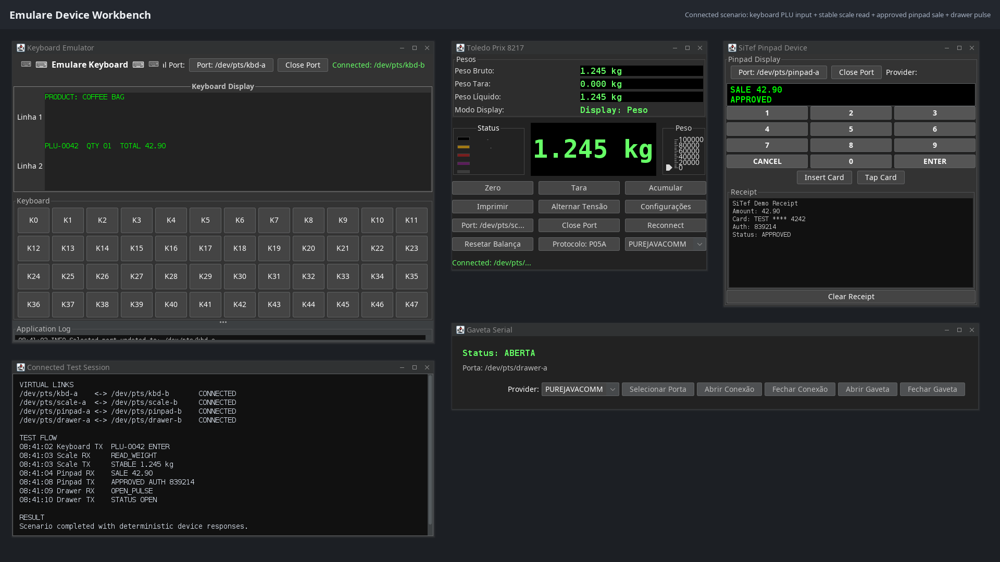
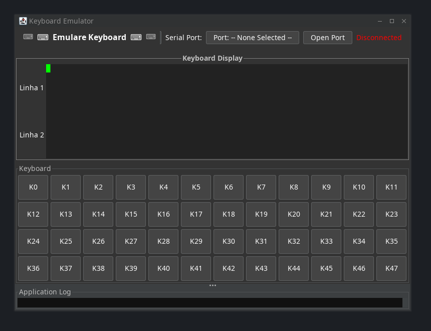
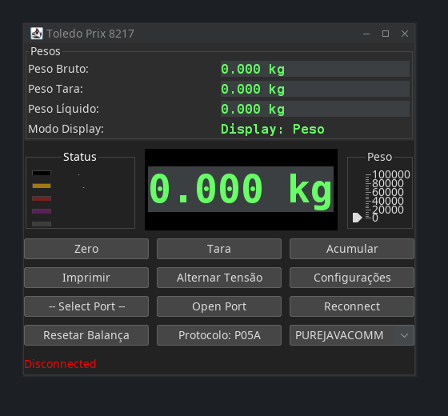
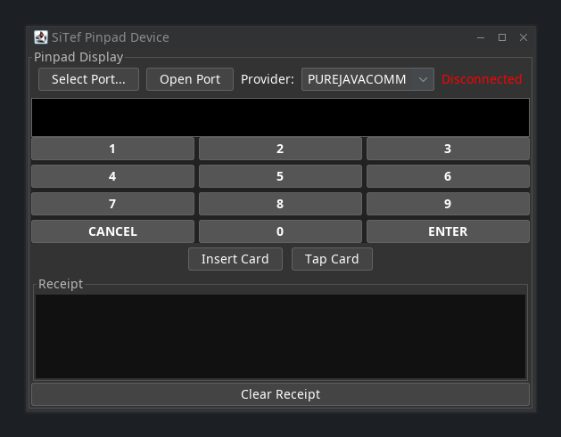
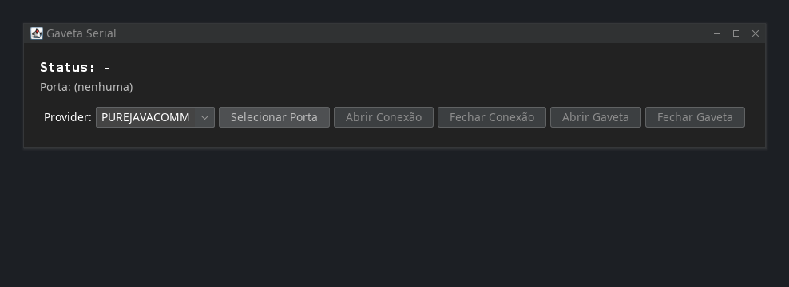

# Emulare

[Back to Software Platforms](../)

Emulare is a device emulation suite for reproducing hardware behavior in commercial and integration-heavy environments.

---

## Platform Status

- Status: Active and maintained
- Documentation level: Public architecture summary and testing research mapping
- Public boundary: no proprietary protocol details, customer-specific behavior, or private integration data

---

## Purpose

Emulare enables teams to test and validate software integrations without requiring every physical device to be present.

It focuses on realistic behavior, repeatable test scenarios, and reliable integration workflows.

---

## Motivation

Hardware integrations are difficult to test consistently.

Physical devices can be unavailable, expensive, fragile, environment-specific, or difficult to reproduce in automated testing.

Emulare exists to make integration testing more predictable.

---

## Business Problem

Commercial systems often depend on devices such as scales, programmable keyboards, fiscal components, payment peripherals, or money-handling equipment.

When these integrations fail, the impact can be operational, financial, and customer-facing.

Emulare reduces dependency on physical hardware during development, testing, and support.

---

## Architecture Overview

At a public level, Emulare can be described through these components:

- Core device and bus abstractions
- Serial communication layer
- Business-device emulator modules
- Desktop GUI for interacting with virtual devices
- All-in-one packaging for local execution
- Logging, diagnostics, and test-support utilities

The platform is documented without exposing proprietary protocol implementations or customer-specific device behavior.

---

## Technologies

The platform is connected to these technology areas:

- Java 21 and Maven multi-module builds
- serial communication libraries
- Swing desktop interfaces
- modular emulator architecture
- virtual serial-port workflows
- device protocol modeling
- logging and diagnostics
- automated testing support

---

## Engineering Decisions

Key engineering decisions include:

- separating device behavior from transport details
- making scenarios deterministic and repeatable
- prioritizing protocol accuracy where public documentation allows it
- supporting manual exploration and automated test flows
- collecting diagnostics that help reproduce integration issues

Tradeoffs considered:

- prioritizing deterministic scenarios over reproducing every physical environment variation
- documenting emulator behavior without exposing proprietary protocol details

---

## Usage Scenario

A developer validates a commercial workflow by running a virtual device, connecting it through a serial communication path, and reproducing the same interaction repeatedly without requiring physical hardware.

---

## Technical Challenge

The main challenge is balancing realistic device behavior with deterministic tests that can be repeated across development and support environments.

The architecture addresses this by separating device behavior, communication transport, diagnostics, and user-facing emulator controls.

---

## Engineering Lesson Learned

Hardware integration becomes more manageable when device behavior is modeled as a testable software boundary instead of treated as an external black box.

---

## Platform Relationships

- Can support EgypTeam Via commercial-device workflow testing.
- Can generate synthetic interaction traces for research experiments.
- Can provide repeatable integration scenarios for future quality-control tooling.

---

## Screenshots

Sanitized screenshots generated from the Emulare Swing device emulators:

- 
- 
- 
- 
- 

Screenshot inventory: [screenshots](screenshots/).

---

## Future Roadmap

Near-term:

- [Product evolution] Expand the catalog of device profiles with public-safe descriptions.
- [Engineering quality] Add more repeatable integration scenarios for regression testing.

Medium-term:

- [Engineering quality] Improve diagnostics for communication failures and scenario reproduction.
- [Product evolution] Connect emulation flows with test orchestration workflows.

Long-term:

- [Research] Prepare public technical reports about emulator-based testing, virtual serial workflows, and simulation fidelity.

---

## Related Research

- Research index: [Research](../../research/)
- Primary direction: emulator-based integration testing, simulation fidelity, virtual serial workflows, and reproducibility
- Future artifacts: technical reports, synthetic protocol traces, and controlled integration experiments

---

## Research Opportunities

Possible future publications:

- Emulator-based testing for commercial hardware integrations
- Measuring fidelity in device simulation platforms
- Reducing integration risk through deterministic hardware emulation

Possible experiments:

- Compare test coverage with and without emulated devices
- Measure time to reproduce hardware-related defects
- Evaluate protocol fidelity across simulated scenarios

Possible technical reports:

- Emulare architecture overview
- Device emulation testing strategy
- Diagnostics model for serial communication failures

Possible datasets:

- synthetic protocol interaction traces
- anonymized failure categories
- device scenario catalogs

