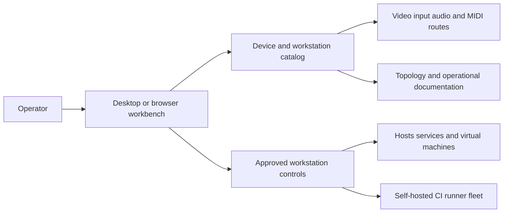

# Galaxy Workstation Manager

[Back to Software Platforms](../)

Galaxy is a local-first workstation manager for cataloging devices, modeling physical workstations, and coordinating video, audio, input, MIDI, development-machine, runner, and remote-desktop workflows.

---

## Platform Status

- Status: Active and operationally evolving
- Documentation level: Public architecture and engineering summary
- Public boundary: no credentials, private keys, enrollment links, customer data, or sensitive infrastructure details

---

## Purpose

Galaxy turns a workstation made of computers, displays, audio devices, input devices, MIDI equipment, and virtual machines into an explicit, inspectable system.

It provides matching desktop and browser workbenches so the same topology can be reviewed and operated through different surfaces.

---

## Motivation

Complex workstations accumulate physical devices, logical connections, host roles, services, and operational procedures over time. When those relationships exist only in memory or scattered notes, maintenance and recovery become fragile.

Galaxy exists to make the workstation model explicit, preserve confirmed versus pending knowledge, and provide controlled operations for the parts that can safely be automated.

---

## Engineering Problem

An integrated workstation may combine local devices, remote machines, audio profiles, display controls, MIDI routing, self-hosted CI runners, virtual machines, and remote desktop sessions.

Galaxy addresses the coordination problem by separating device models from physical devices, representing logical connections, and exposing operational workflows through focused commands and workbenches.

---

## Architecture Overview

At a public level, Galaxy can be described through these layers:

- Device model catalog for reusable equipment definitions
- Physical device inventory for concrete workstation instances
- Logical connection model for video, input, audio, and MIDI relationships
- Desktop and browser workbenches for topology visualization and control
- Operational command layer for development machines, CI runners, and remote desktop
- Host and virtual-machine documentation for infrastructure context
- Read-only mode and confirmation boundaries for safer workstation changes

The platform keeps the catalog and physical inventory separate so device metadata can be completed without changing the workstation topology.

---

## Technologies

The platform is connected to these technology areas:

- Java and Maven multi-module architecture
- Swing desktop workbench
- browser-based workbench
- PipeWire and PulseAudio-oriented audio workflows
- MIDI and patchbay graph inspection
- DDC/CI monitor control
- Linux services and systemd user units
- GitHub Actions self-hosted runner operations
- XRDP and Xorg session workflows
- local workstation and Kubernetes-adjacent operational tooling

---

## Engineering Decisions

Key engineering decisions include:

- separating reusable device models from physical device records
- representing connections explicitly instead of encoding topology only in UI code
- sharing the workstation catalog between desktop and browser workbenches
- requiring confirmation for approved hardware changes and offering a read-only mode
- distinguishing confirmed, planned, occasional, and pending-discovery observations
- keeping operational procedures documented alongside the executable model

Tradeoffs considered:

- prioritizing a local-first operator experience over cloud dependence
- allowing controlled host integrations without making every workstation action automatic
- preserving uncertainty in the inventory rather than converting visual observations into unsupported facts

---

## Usage Scenario

An operator opens the workstation workbench, reviews the current topology, selects a display or audio profile, and confirms an approved change. The same platform can inspect development-machine convergence, runner health, MIDI state, or remote-desktop installation through dedicated operational commands.

---

## Technical Challenge

The main challenge is coordinating physical topology, logical routes, host services, and operational controls while keeping the system safe to run on a real workstation.

Galaxy addresses this with explicit inventory boundaries, confirmation requirements, read-only operation, and documentation that distinguishes known topology from discovery backlog.

---

## Engineering Lesson Learned

Infrastructure tools become more trustworthy when they model uncertainty explicitly and separate observation, configuration, and execution. A workstation catalog is most useful when it can explain both what it knows and what still needs discovery.

---

## Platform Relationships

- Can support Echora research around audio devices, MIDI routing, and live-performance workspaces.
- Can provide workstation and deployment-environment patterns for other local-first platforms.
- Can contribute infrastructure observability and topology concepts to future research.

---

## Screenshots

No public screenshots are included yet.

Future images should be sanitized and added under [screenshots](screenshots/).

---

## Future Roadmap

Near-term:

- [Engineering quality] Document the public device, connection, and workstation domain model.
- [Product evolution] Add sanitized workbench screenshots showing topology review and safe controls.

Medium-term:

- [Engineering quality] Expand automated tests around topology consistency and read-only behavior.
- [Operations] Improve recovery workflows for runners, development machines, and remote desktop.

Long-term:

- [Research] Prepare technical reports about executable workstation topology and infrastructure knowledge preservation.

---

## Related Research

- Research index: [Research](../../research/)
- Primary direction: workstation topology, infrastructure operations, device integration, and explicit operational knowledge
- Future artifacts: technical reports, synthetic topology datasets, and controlled recovery experiments

---

## Research Opportunities

Possible future publications:

- Executable topology models for local-first workstations
- Safe control boundaries for hardware-integrated developer environments
- Preserving uncertainty in infrastructure inventories

Possible experiments:

- Compare manual workstation recovery with catalog-guided recovery
- Evaluate topology consistency checks after device or route changes
- Measure operator effort for read-only inspection versus approved control workflows

Possible technical reports:

- Galaxy architecture overview
- Workstation catalog and logical connection model
- Operational safety model for device and host controls

Possible datasets:

- synthetic workstation device catalogs
- anonymized video, audio, input, and MIDI topology graphs
- workstation recovery and discovery scenarios
