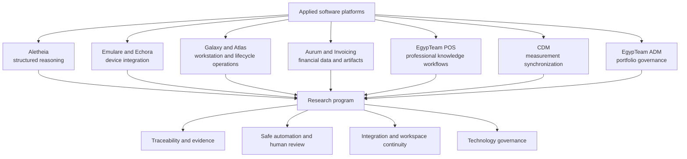

# Platform Research Map

```mermaid
flowchart TB
    platforms[Applied software platforms]
    platforms --> reasoning[Aletheia\nstructured reasoning]
    platforms --> integration[Emulare and Echora\ndevice integration]
    platforms --> operations[Galaxy and Atlas\nworkstation and lifecycle operations]
    platforms --> finance[Aurum and Invoicing\nfinancial data and artifacts]
    platforms --> professional[EgypTeam POS\nprofessional knowledge workflows]
    platforms --> measurement[CDM\nmeasurement synchronization]
    platforms --> governance[EgypTeam ADM\nportfolio governance]
    reasoning --> research[Research program]
    integration --> research
    operations --> research
    finance --> research
    professional --> research
    measurement --> research
    governance --> research
    research --> traceability[Traceability and evidence]
    research --> automation[Safe automation and human review]
    research --> continuity[Integration and workspace continuity]
    research --> strategy[Technology governance]
```

This conceptual figure is publication-safe and intentionally omits implementation, infrastructure, and customer details.
