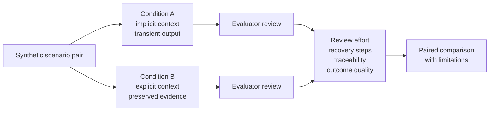

# Traceability Experiment Model

```mermaid
flowchart LR
    input[Synthetic scenario pair] --> implicit[Condition A\nimplicit context\ntransient output]
    input --> explicit[Condition B\nexplicit context\npreserved evidence]
    implicit --> reviewA[Evaluator review]
    explicit --> reviewB[Evaluator review]
    reviewA --> metrics[Review effort\nrecovery steps\ntraceability\noutcome quality]
    reviewB --> metrics
    metrics --> analysis[Paired comparison\nwith limitations]
```

The figure summarizes the protocol defined in [Explicit Context and Traceability](../experiments/explicit-context-traceability/).
